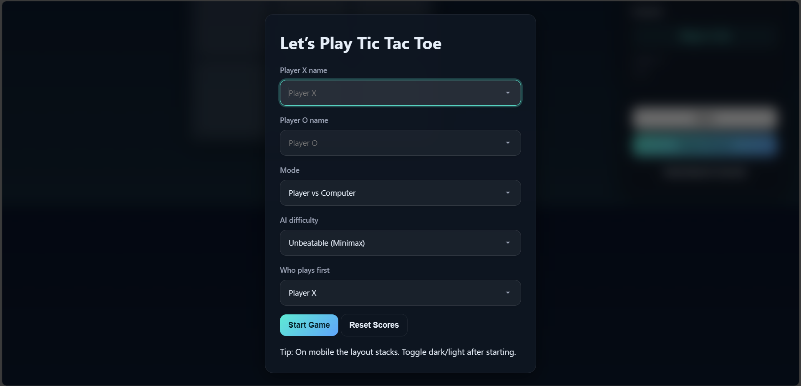
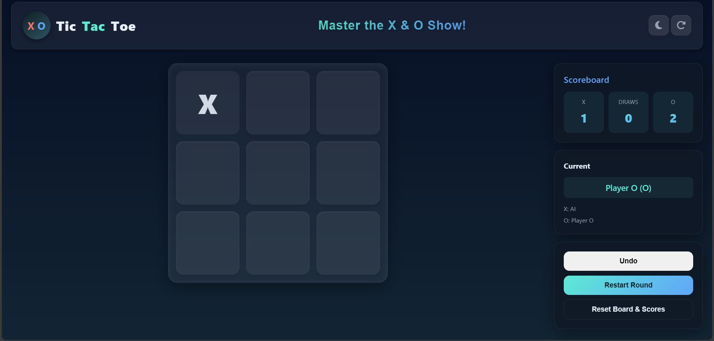
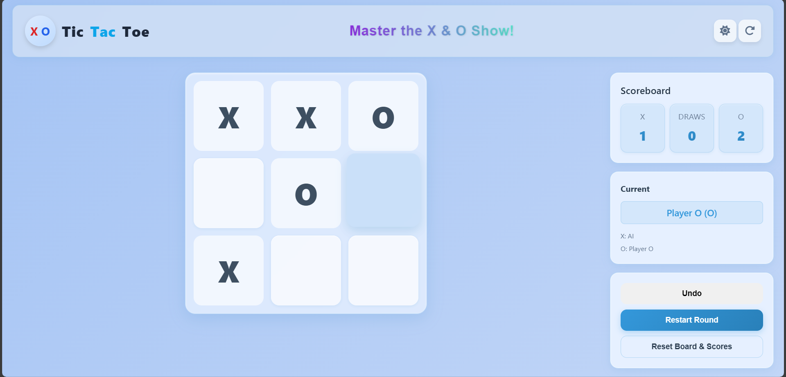

# CodSoft Task-1: Modern Tic Tac Toe Game 🎮

## 📌 Overview
This project is part of my **CodSoft AI Internship (August 2025)**.  
I have built a **Modern Tic Tac Toe Web Application** with advanced features such as Player vs Player, Player vs Computer (AI), score tracking, and celebration effects.

## 🛠️ Technologies Used
- **HTML5** – Structure and layout  
- **CSS3** – Styling with modern dark/light themes  
- **JavaScript (ES6)** – Game logic, AI (Minimax algorithm), UI interactions  

## 🚀 Features
✔️ Player vs Player (PvP) mode  
✔️ Player vs Computer (AI) mode  
✔️ AI difficulty – Easy (Random) & Hard (Minimax)  
✔️ Undo, Restart, and Full Reset options  
✔️ Scoreboard with LocalStorage (persistent scores)  
✔️ Winner Celebration – Confetti, Pop sounds, Glow effects  
✔️ Dark/Light Theme toggle  
✔️ Fully Responsive (works on mobile and desktop)  

## 📂 Project Structure
```

├── index.html    # Main UI structure
├── style.css     # Modern styling (dark/light theme)
├── script.js     # Game logic + AI (Minimax, Random)
└── README.md     # Project documentation

````

---

## 🎯 How to Run

### 🔹 Option 1: Play Online (Best)  
👉 [Play Tic Tac Toe Online](https://swati2005prajapati.github.io/codsoft_task1/)  

### 🔹 Option 2: View Source Code on GitHub  
👉 [GitHub Repository](https://github.com/Swati2005prajapati/codsoft_task1)  

### 🔹 Option 3: Run Locally  
Clone this repo to your computer and open `index.html` in your browser:  

```bash
git clone https://github.com/Swati2005prajapati/codsoft_task1.git
cd codsoft_task1
````

---

## 📸 Screenshots / Demo

### 🎮 Game Start



### 🤖 Player vs Computer



### 🎉 Celebration Effect



---

## 🔗 Links

* 🎥 LinkedIn Post: (link to task completion video)
* 🌐 CodSoft: [CodSoft Internship](https://codsoft.in)
- 👩‍💻 [LinkedIn Profile](https://www.linkedin.com/in/swati-prajapati-b723b7368)
- 📂 [GitHub Profile](https://github.com/Swati2005prajapati)


Thanks to **CodSoft** for providing this internship opportunity.
This task helped me strengthen my web development, UI design, and AI logic implementation skills.


